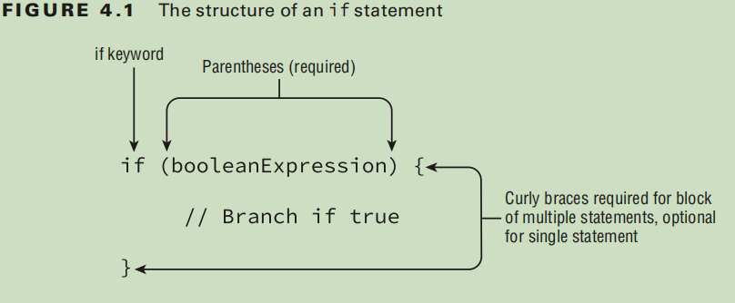
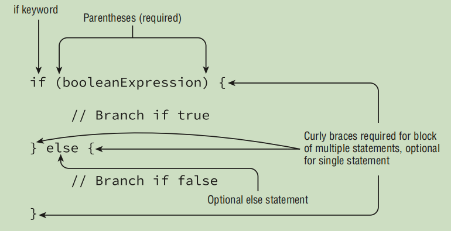
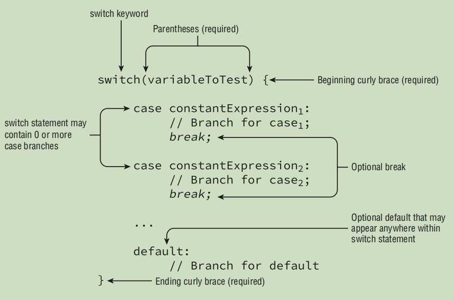
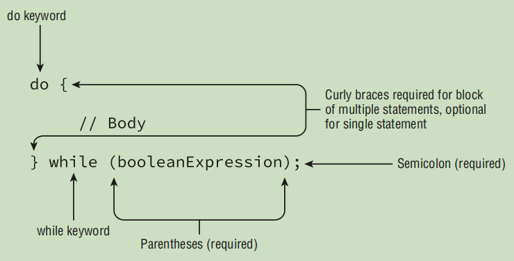
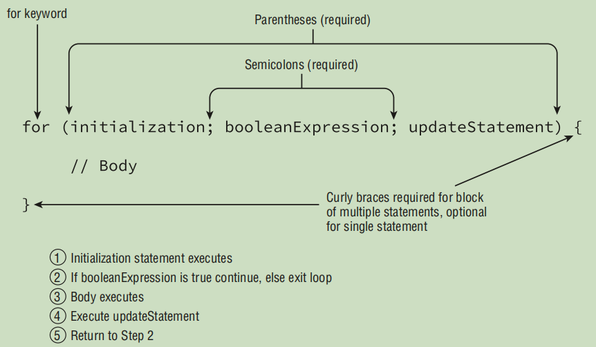
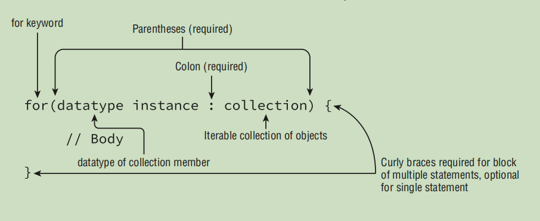

# First Part of OCP 1z0-819 (Former 1z0-815)

## Summary

- [Table of Contents](#summary)
  - [Java Building Blocks](#Java-Building-Blocks)
  - [Operators](#Operators)
  - [Making Decisions](#Making-Decisions)
  - [Core Java APIs](#Core-Java-APIs)


## Java Building Blocks

- **Object** is an instance of a class
- Fields and instance initializer blocks are run in the order in which they appear the file.
- The constructor runs after all fields and instance initializer blocks have run
- A **variable** is a name for a piece of memory that stores data
- A **local variable** is a variable defined within a constructor, method, or initializer block
- An **instance variable**, often called a field, is a value defined within a specific instance of an object
- For **local variable type inference**, the compiler looks only at the line with the declaration. **var** only aviable for local variables inside a method body
- null value cannot be assigned to var, unless there's a casitng:
  ```java
  var obj = null; //DOES NOT COMPILE
  var obj1 = (Object) null; //DOES COMPILE
  ```
- var variable must be initialized at the same line where declared

## Operators

- Smaller data types, namely, byte, short , and char , are first promoted to int any time they’re used with a Java binary arithmetic operator, even if neither of the operands is int.

- Casting , between Objects, is allowed only if the underlying object is already a member of the class or interface.

- when using compound assignments operators, the compiler will automatically cast the resulting value to the data type of the value on the left side of the compound operator.

- Two references are equal if and only if they point to the same object or both point to null

## Making Decisions

- a **block of code** in Java is a group of zero or more statements
  between balanced braces ({}) and can be used anywhere a single statement is allowed:

  ```java
  number++; // Single Statement

  {
      number++; //Statement inside a block
  }
  ```



### The strucutre of an else statement



### The structure of a switch statement



- a **switch** statement is not required to contain any **case** statements:

  ```java
  switch (fruit){} //Valid syntax
  ```

- boolean, long, float , and double are excluded from **switch
  statements**, as are their associated Boolean, Long, Float , and Double classes.

- A **loop** is a repetitive control structure that can execute a statement of code multiple times in succession.

### The Structure of a while statement


### The Structure of a do/while statement



- a **do/while** loop purposely orders the body before the conditional expression so that the body will be executed at least once.

- An **infinite loop** is a loop whose termination condition is never reached during runtime.

### The Structure of a Basic For Loop



- The variables in the **_initialization block_** must all be of the same type:

  ```java
  int x = 0;
  for(long y = 0, int z = 4; x < 5; x++) { // DOES NOT COMPILE
  System.out.print(y + " ");
  }
  ```
### The Structure of an Enhanced For-Each Loop


- The right side of the for-each loop must be one of the following:
  - A built-in Java array
  - An object whose type implements java.lang.Iterable

- This does not include all of the Collections Framework classes or interfaces, but only those that implement or extend that ***Collection*** interface. For example, ***Map*** is not supported in a for-each loop, although ***Map*** does include methods that return Collection instances.

- The left side of the for-each loop must include a declaration for an instance of a variable whose type is compatible with the type of the array or collection on the right side of the statement.

## Core Java APIs

- A ***string*** is basically a sequence of characters.
-  Placing one String before the other String and combining them is called string ***concatenation***.
- **Immutability** - Once a ***String*** object is created, it is not allowed to change. It cannot be made larger or smaller, and you cannot change one of the characters inside it.
- **Immutable** classes in Java are final, which prevents subclasses creation.
- A **string** is a sequence of characters and Java counts from 0 when indexed.
  - ### Indexing for a string
    

- When determining the total size or length, Java uses normal counting again:
  ```java
    String string = "animals";
    System.out.println(string.length()); // 7
  ```
- **indexOf()** method returns –1 when no match is found:
  ```java
    String string = "animals";
    System.out.println(string.indexOf('a', 4)); // 4
    System.out.println(string.indexOf("al", 5)); // -1
  ```
- In the **substring()** method **endIndex** parameter is allowed to be 1 past the end of the sequence if you want to stop at the end of the sequence.
  - ### Indexses for a substirng
     
- **substring()** methods parametehrs **String substring(int beginIndex, int endIndex)**. beginIndex is inclusive. However endIndex is exclusive:
  ```java
  String string = "animals";
  System.out.println(string.substring(3, 7)); // mals
  ```
- The ***equals()*** method checks whether two String objects contain exactly the same characters in the same order. The ***equalsIgnoreCase()*** method checks whether two String objects contain the same characters with the exception that it will convert the characters’ case if needed:
  ```java
  System.out.println("abc".equals("ABC")); // false
  System.out.println("ABC".equals("ABC")); // true
  System.out.println("abc".equalsIgnoreCase("ABC")); // true
  ```
- The ***strip()*** method is new in Java 11. It does everything that ***trim()*** does, but it supports Unicode.
- The ***intern()*** method returns the value from the string pool if it is there. Otherwise, it adds the value to the string pool.
- Unlike the ***String*** class, ***StringBuilder*** is not immutable.
- **StringBuffer** works the same way as ***StringBuilder*** except it supports threads(threadsafe).
- ***StringBuffer*** is no longer on either exam. It performs slower than **StringBuilder**.
- The ***delete()*** method is more flexible than some others when it comes to array indexes. If you specify a second parameter that is past the end of the StringBuilder, Java will just assume you meant the end. That means this code is legal:
  ```java
  StringBuilder sb = new StringBuilder("abcdef");
  sb.delete(1, 100); // sb = a
  ```
-  ***equals*** method check the values inside the String rather than the string reference itself. If a class doesn’t have an equals method, Java determines whether the references point to the same object—which is exactly what **==** does.
- **==** is checking for object reference equality.
- The **string pool**, also known as the **intern pool**, is a location in the Java virtual machine (JVM) that collects all these strings.
- The ***JVM*** created only **one** literal in memory.
- Never use intern() or == to compare String objects in your code.
- This approach is called an anonymous array. It is anonymous because you don’t specify the type and size:
  ```java
  int[] numbers2 = {42, 55, 99};
  ```
- Just like a **StringBuilder**, an **ArrayList** can change capacity at runtime as needed.  Like an ***array***, an **ArrayList** is an ordered sequence that allows duplicates.
- ***ArrayList*** implements an interface called **List**. In other words, an ***ArrayList is a List***.
- The **valueOf()** allows object caching. The wrapper classes are immutable and take advantage of some caching as well. The **valueOf()** returns Wrapper class (Integer, Double, etc.). **Parse** methods (***parseInt()*** etc.)  return a primitive, 
and the ***valueOf()*** method returns a wrapper class.
- **Arrays.asList(array)** point to the same data store ***array***. Change in **Arrays.asList(array)** will affect ***array*** directly and vice verse.
- ***Array.asList()*** cannot change size.
- ***List.of(array)*** create immutable list. Have not any realtion with original ***array***.
- ### Array and List conversions
     
- Calling == on ***String*** objects will check whether they point to the same object in the pool. Calling == on ***StringBuilder*** references will check whether they are pointing to the same StringBuilder object. Calling equals() on ***String*** objects will check whether the 
sequence of characters is the same. Calling equals() on StringBuilder objects will check whether they are pointing to the same object rather than looking at the values inside.
- Understand the difference between == and equals(). == checks object equality. 
equals() depends on the implementation of the object it is being called on. For Strings, equals() checks the characters inside of it.
  
